# Plant-enarium

Készítette: Hugyecz Petra

###Követelményanalízis
####Célkitűzés
A célom egy olyan oldal létrehozása, ami az egyes virágok gondozását, igényeit írja le. Vendégként csak nézni tudom az egyes leírásokat. Lehetőség lesz regisztrálni az oldalra. Bejelentkezés után tudok majd saját leírásokat is csinálni, és tudom értékelni az egyes virágokat.

#####Funkcionális követelmények
######Vendégként:
* főoldalon látni a legújabb virágokat
* a virágok között szabadon böngészni
* megnézni az egyes virágok leírását
* virágot keresni 
* regisztrálni az oldalra

#####Felhasználóként:
* bejelentkezni az oldalra
* megtekinteni a személyes adataimat
* módosítani a személyes adataimat
* virágot értékelni
* virág leírást hozzáadni
* a saját leírásaimat törölni vagy módosítani
* kijelentkezni

#####Nem funkcionális követelmények
* gyors, biztonságos működés (jelszavak tárolása) 
* könnyű áttekintés (virágok ABC sorrendben és kategóriák szerint is)
* karbantarthatóság

#####Szakterületi fogalomjegyzék
* **Bonsai:** Lapos tálban nevelt fa. mMsterségesen, művészien alakított, formára metszett fa.
* **Rovaremésztő növények:** Köznapi nevén húsevő növények. Olyan növények, amelyek csupán tápanyagaik egy részét nyerik állati húsból, s nem az élethez szükséges kémiai energiát. Főként rovarokat és más ízeltlábúakat ejtenek csapdába. 
* **Évelő növények:** Azokat a lágyszárúakat szoktuk így nevezni, amik hosszú ideig élnek és termésérés után a föld feletti száruk elpusztul, viszont mindig van földbeli száruk (hagyma, gumó), vagy vastag gyökerük, ami áttelel.
* **Pozsgások:** Olyan növények, amelyek szárazságtűrőek, vagyis nem vízigényesek. Ide tartoznak a kaktuszok és sok sivatagi növény is. 
* **Balkonnövények:** Meghatározott mennyiségű földben, általában erkélyeken vagy teraszonok tartott egyéves növények.

##Használati esetek
####Használatieset-modell
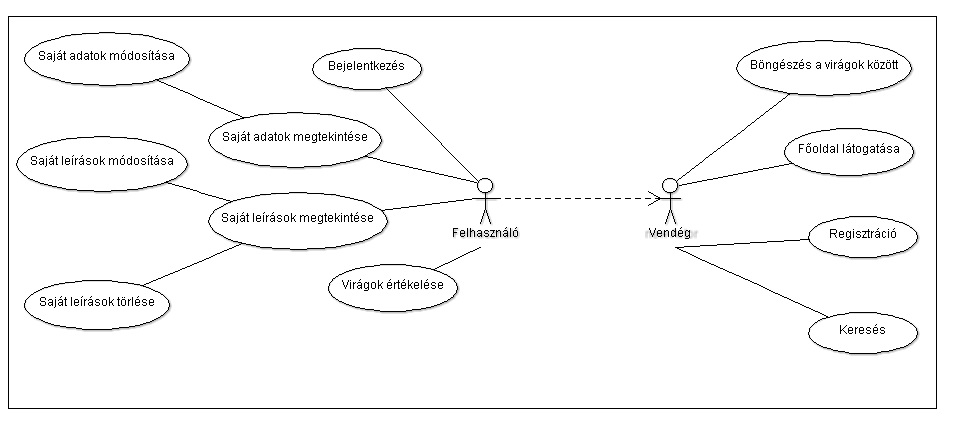

####Használatiesetek részletes folyamatai
Vegyük példának a regisztrációt:
* felhasználó megérkezik a főoldalra
* főoldalon kiválasztja a Regisztráció gombot
* megadja a kért adatokat
* ha azok megfelelnek a szabályoknak, akkor kész a regisztráció, ha nem, akkor az oldal kijelzi a hibákat és újra kéri az adatokat
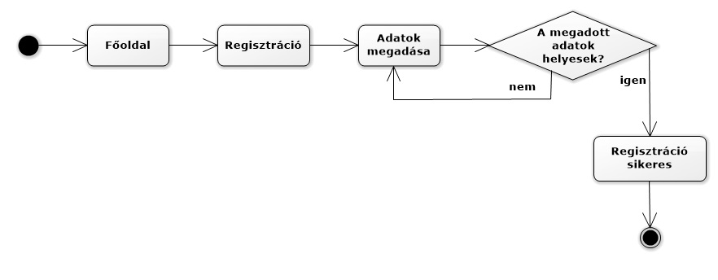

####Adatbázisterv

###Végpontok
####PlantController
* GET/: főoldal
* GET/plant/az: virágok A-Z
* GET/plant/category: virágok kategóriák szerint
* GET/plant/create: új virág létrehozása
* POST/plant/create: új virág létrehozási adatainak felküldése
* GET/:id/plantEdit: virág szerkesztése
* POST/:id/plantEdit: virág szerkesztési adatainak felküldése
* GET/plant/search: virág keresése
* POST/plant/search: virág keresésési adatok felküldése
* GET/:id/delete: virág törlése
* GET/plant/:id: virág adatok
* GET/:id/createReview: új vélemény írása
* POST/:id/createReview: új vélemény adatainak felküldése

####UserController
* GET/register: regisztrációs oldal
* POST/register: regisztráció adatainak felküldése
* GET/login: bejelentkezés oldal
* POST/login: bejelentkezés adatainak felküldése
* GET/logout: kijelentkezés
* GET/user/:id: saját profil oldal
* GET/:id/userEdit: saját adatok szerkesztése oldal
* POST/:id/userEdit: új saját adatok felküldése
* GET/:id/myList: saját virágok oldal

####Egyéb
* GET/*: visszairányítás a főoldalra

####Oldalvázlatok

**Főoldal**
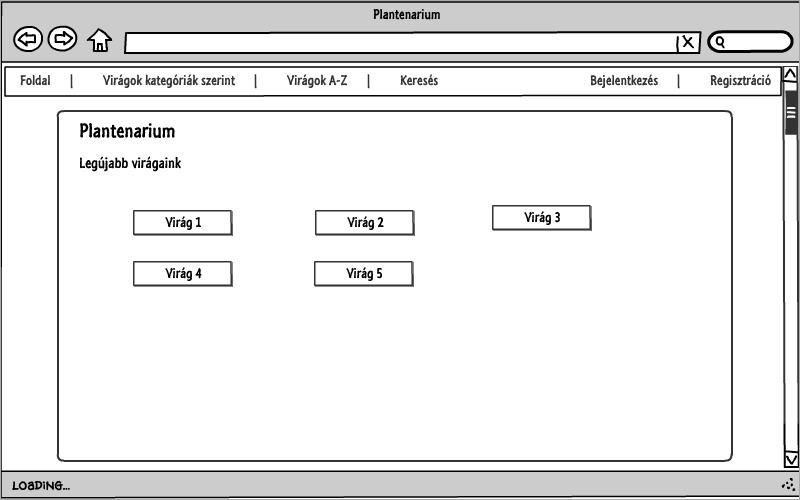

**Virágok kategóriák szerint**
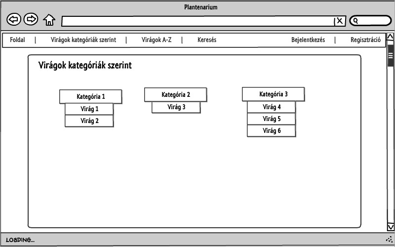

**Keresés**
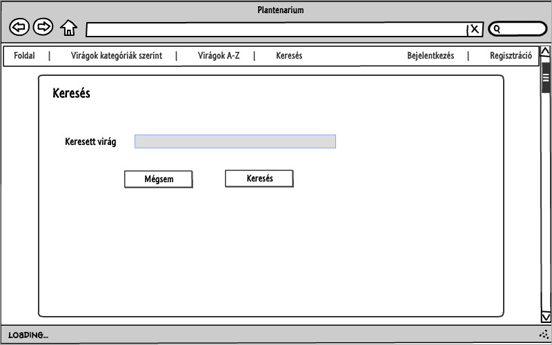

**Regisztráció**
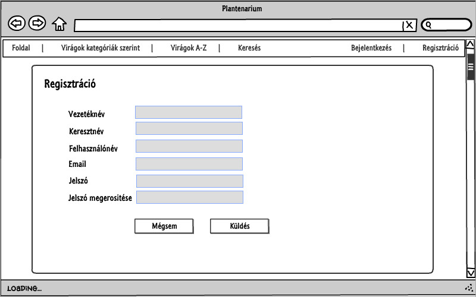

**Bejelentkezés**
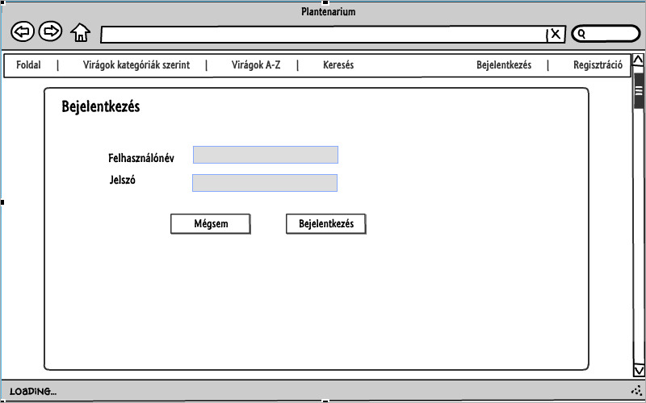

**Saját virágaim**
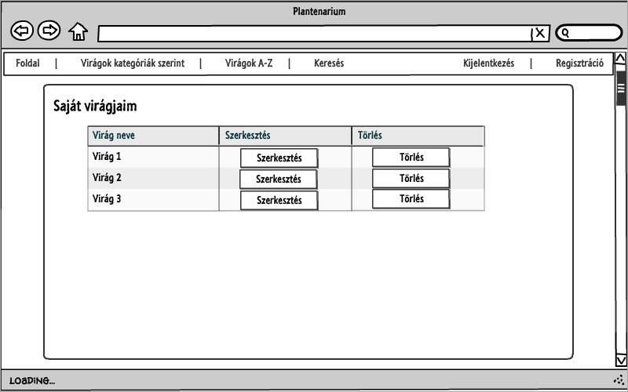

**Virág leírása**
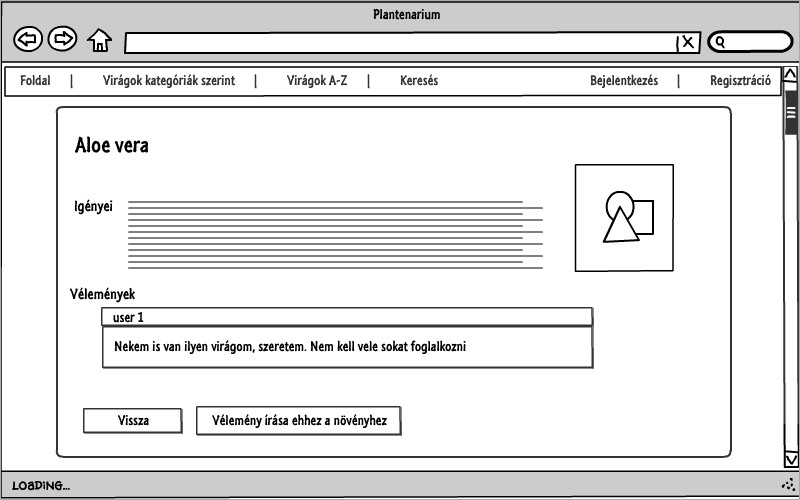

**Új virág létrehozása**
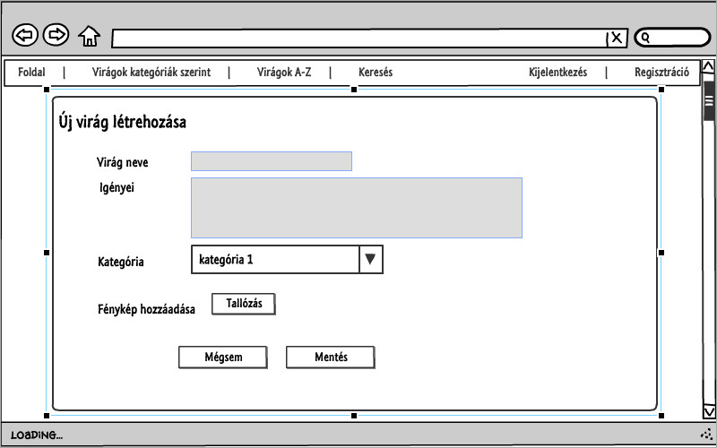

####Végső megvalósítás kinézete

**Főoldal**
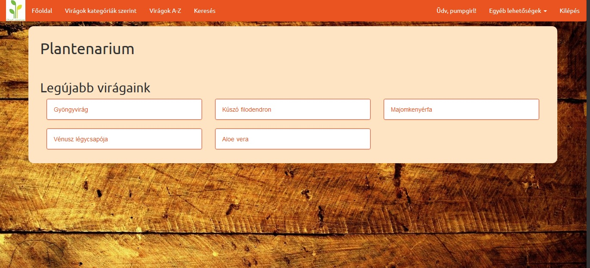

**Virágok kategóriák szerint**
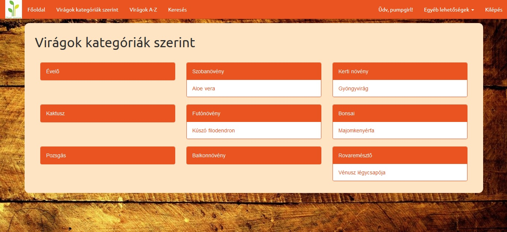

**Új virág létrehozása**
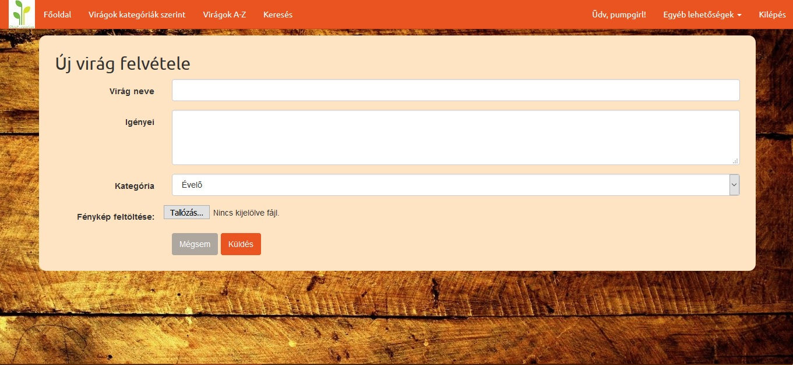

**Virág leírás**
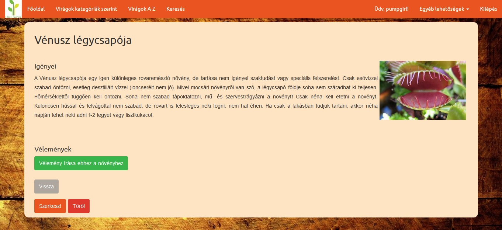

####Fontos megjegyzés
A kép feltöltése csak úgy működik, ha az a kép, amit fel szeretnénk tölteni, a public/picture mappában van

## 3. beadandó kiegészítés
###Funkciókban érintett fájlok:
* scripts:
	- categories.js
	- delete.js
	- popup_login.js
	- short_name.js
* controllers:
	-UserController
	-PlantColrtoller
* routes.js
* resources

###Funkciók folyamatának leírása
* categories.js:
	- a kategória nézetnél (categoryView) megjelennek a kategóriák nevei külön felsorolva
* delete.js: 
	- bármely növény törlésekor felugrik egy új ki ablak, megerősítést kér, hogy biztosan törölni 	szeretnénk-e az adott növényt
	- ha igen, akkor a PlantController ajaxDelete metódusa megkapja az adatokat (ajax/id/delete-	n keresztül) és törli az adott id-jű növényt
	- ezután visszatérünk a főoldalra
* popup_login.js:
	- a Bejelentkezés gombra kattintva felugrik egy új kis ablak, ahol az adatok beírásával 	tudunk bejelentkezni
	- a UserController-beli ajaxLogin metódus megkapja a beírt adatokat (ajax/login -on 	keresztül), és leellenőrzi
	- ha nem helyesek, akkor hibát kapunk
	- ha jók az adatok, akkor megtörténik a bejelentkezés
* short_name.js:
	- A-Z nézetben és a főoldalon külön kék kerettel vannak jelezve a 15 betűnél növidebb nevű 	virágok
* resources fájlokban:
	- azokon az oldalakon, ahol kötelezően szöveget kell beírni (Virág szerkesztése, 	Regisztráció, Saját adatok szerkesztése, Új virág felvétele) bootstrap-validator ellenőrzi, 	hogy megvannak-e adva a kötelező mezők

 ###Tesztek
* a tesztekhez Selenium IDE telepítése szükséges
* tesztek lefuttatása előtt be kell jelentkezni az oldalra
* ajánlott sorrend:
	- sajat_profil_szerkesztese
	- noveny_kereses
	- velemenyek_irasa
	- uj_virag_felvetele
	- noveny_torlese

####Fontos megjegyzés
Ha kikapcsoljuk a Javascriptet, akkor nem működik az Egyéb lehetőségeknél a lenyíló menü sem. Ezt nem tudtam máshogy megoldani, így volt benne a bootswatch-os sablonban. 